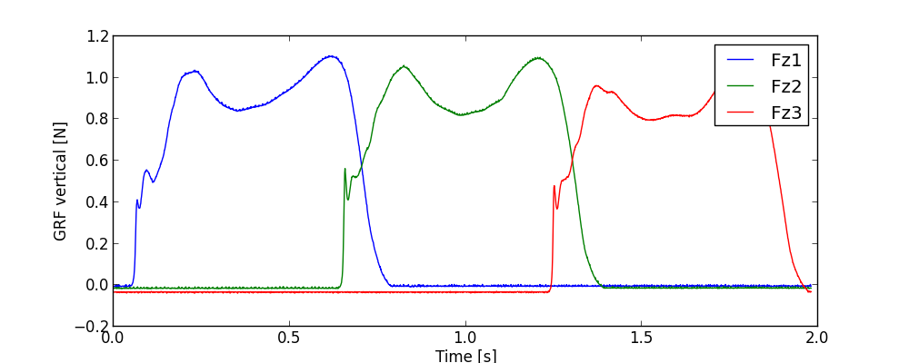
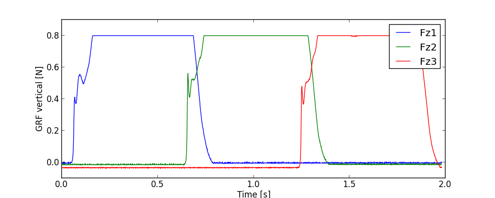

c3dfileEditor
=============

A a script that reads, plots data as well as modifies c3d files using the btk library.

##Modules needed

###Python pacakges
<pre>
numpy
Matplotlib
BTK
</pre>

To install python2 packages you need to run pip.
For example to install numpy, you need to run:

<pre>pip install numpy</pre>

BTK is the exception here. I was not able to get btk working through pip. BTK also seems to be architectural dependent as it was not installing in my ARCH distribution. I was able to get it working on Fedora 19 by installing the python wrapper package from here

<pre>https://code.google.com/p/b-tk/</pre>

Then run:

<pre> yum localinstall <packagename>.rpm </pre>

## Running it

This program was hardcoded for the research I was doing in biomechanics. It graphs all the analog forces in the x,y, and z direction. Currently it modifies the file by setting a limit for the force in the z direction to mimic heal-toe running.

Before running this script you must add in the name of your c3d file. To do that you must edit this line.
<pre><code>reader = btk.btkAcquisitionFileReader()  # build a btk reader object 
reader.SetFilename('GaitNormal0003-processed.c3d')      # set a filename to the reader
acq = reader.GetOutput()                 # btk aquisition object</code></pre>

You can then run the program as follows:

<pre> python c3dfileeditor.py modified.c3d 0.8 </pre>

where modified.c3d is the name you want your modified file to be and 0.8 is the cutoff.

The results are then graphed.

## Sample Run:

###Unmodified c3d z axis

###Modified c3d file

